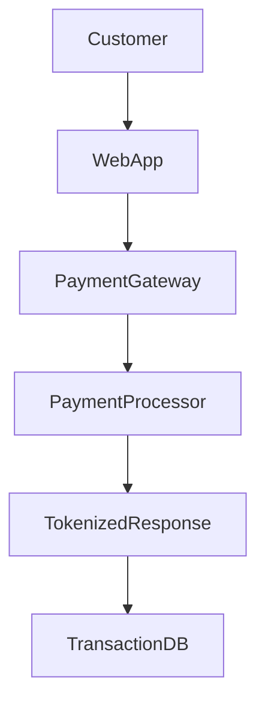

# PCI DSS Scope Determination & Network Segmentation Assessment

## Project Overview

This project simulates a PCI DSS v4.0 scope determination engagement conducted for a mid-sized e-commerce company.

The objective was to identify the Cardholder Data Environment (CDE), determine which systems fall within PCI DSS scope, assess network segmentation effectiveness, identify security-impacting assets, and provide recommendations prior to a formal Qualified Security Assessor (QSA) review.

---

## Skills Demonstrated

- PCI DSS v4.0
- Scope Determination
- Cardholder Data Environment (CDE) Analysis
- Network Segmentation Assessment
- Risk Assessment
- Security Control Evaluation
- Audit Readiness
- Security Governance
- Technical Documentation

---

# Business Scenario

## Client Profile

**Organization:** ShopSphere E-Commerce Pvt. Ltd.

ShopSphere is a growing online retail company processing approximately 250,000 payment transactions annually through its web and mobile applications.

The company uses a third-party payment processor; however, payment data traverses internal infrastructure before tokenization occurs.

Management requested a PCI DSS scope assessment to answer the following questions:

- What systems are actually in PCI scope?
- Which supporting systems impact PCI security?
- Is current segmentation sufficient?
- What remediation activities should be prioritized?

---

# Project Objectives

The assessment focused on:

- Identifying all systems that store, process, or transmit cardholder data
- Identifying connected systems
- Identifying security-impacting systems
- Evaluating trust relationships
- Reviewing segmentation controls
- Reducing unnecessary PCI scope
- Preparing for a future QSA assessment

---

# Assessment Methodology

The assessment followed PCI DSS v4.0 scope determination guidance.

## Phase 1 — Asset Discovery

Identify systems that:

- Store cardholder data
- Process cardholder data
- Transmit cardholder data

---

## Phase 2 — Data Flow Analysis

Review:

- Payment workflows
- API communications
- Database interactions
- Third-party payment integrations

---

## Phase 3 — Connected Systems Review

Determine:

- Directly connected systems
- Indirectly connected systems
- Shared services
- Trust relationships

---

## Phase 4 — Segmentation Validation

Review:

- Firewall rules
- VLAN architecture
- Access controls
- Administrative pathways

---

## Phase 5 — Risk Assessment

Identify:

- Scope expansion risks
- Segmentation weaknesses
- Security-impacting assets

---

# Cardholder Data Environment (CDE)

## In-Scope Systems

The following assets were determined to be part of the CDE.

| System | Purpose |
|----------|----------|
| Checkout Application | Captures payment information |
| Payment API Gateway | Routes payment transactions |
| Payment Database | Stores tokenized transaction records |
| Payment Logs | Records transaction events |
| Payment Backup Repository | Stores encrypted backups |

---

## Payment Data Flow

```text
Customer
   │
   ▼
Checkout Application
   │
   ▼
Payment API Gateway
   │
   ▼
External Payment Processor
   │
   ▼
Tokenized Response
   │
   ▼
Transaction Database
```

---

# Connected Systems Assessment

Connected systems were reviewed to determine whether compromise could impact the confidentiality, integrity, or availability of cardholder data.

---

## Finding 01 — Active Directory

### Observation

Active Directory provides authentication services for PCI systems and administrative users.

### Risk

Compromise of Active Directory could result in unauthorized access to PCI systems.

### Assessment

Included within PCI scope.

### Risk Rating

**High**

---

## Finding 02 — SIEM Platform

### Observation

The SIEM receives logs from PCI systems.

### Risk

Compromise could affect security monitoring and incident detection.

### Assessment

Included within PCI scope.

### Risk Rating

**Medium**

---

## Finding 03 — Backup Infrastructure

### Observation

Encrypted backups of PCI systems are stored within centralized backup infrastructure.

### Risk

Unauthorized access could expose sensitive transaction records.

### Assessment

Included within PCI scope.

### Risk Rating

**Medium**

---

## Finding 04 — Vulnerability Management Platform

### Observation

The vulnerability scanner has authenticated access to PCI systems.

### Risk

Compromise could provide privileged visibility into PCI assets.

### Assessment

Included within PCI scope.

### Risk Rating

**Medium**

---

# Security Impacting Systems

The following assets do not directly process payment data but can impact PCI security controls.

| System | Security Function |
|----------|----------|
| Active Directory | Authentication |
| SIEM | Security Monitoring |
| Backup Platform | Data Recovery |
| Vulnerability Scanner | Security Assessment |
| Patch Management Platform | Security Maintenance |
| PAM Solution | Privileged Access Control |

---

# Network Segmentation Assessment

## Existing Controls

The organization has implemented:

- Dedicated PCI VLAN
- Firewall rule restrictions
- Multi-factor authentication
- Role-based access controls
- Centralized monitoring
- Privileged access management

---

## Finding 05 — Shared Active Directory

### Observation

PCI and non-PCI systems share the same Active Directory infrastructure.

### Risk

A compromise originating from non-PCI assets could impact PCI authentication systems.

### Impact

Increases PCI scope and attack surface.

### Recommendation

Implement a dedicated PCI administrative tier or strengthen administrative segmentation.

### Risk Rating

**High**

---

## Finding 06 — Shared Backup Environment

### Observation

PCI and non-PCI backups are stored within the same backup platform.

### Risk

Expanded scope and increased exposure during backup compromise scenarios.

### Recommendation

Implement logical separation and dedicated access controls for PCI backups.

### Risk Rating

**Medium**

---

## Finding 07 — Firewall Governance

### Observation

Firewall reviews occur annually.

### Risk

Misconfigured rules may remain undetected for extended periods.

### Recommendation

Conduct quarterly firewall rule reviews.

### Risk Rating

**Medium**

---

# Risk Summary

| Finding | Risk Rating |
|-----------|------------|
| Shared Active Directory | High |
| Shared Backup Environment | Medium |
| Firewall Governance | Medium |

---

# Recommendations

## Immediate Actions (0–30 Days)

- Validate privileged accounts
- Review firewall configurations
- Perform segmentation testing

---

## Short-Term Actions (30–90 Days)

- Implement quarterly firewall reviews
- Strengthen service account governance
- Expand monitoring coverage

---

## Long-Term Actions (90+ Days)

- Create dedicated PCI administration tier
- Separate PCI backup repositories
- Implement continuous compliance monitoring

---

# Final Assessment

## Scope Determination Result

PCI DSS scope successfully defined.

---

## Overall Risk Rating

**Medium**

---

## Assessment Conclusion

The organization demonstrates a mature security posture and effective segmentation architecture.

However, several shared services currently increase PCI scope and should be addressed to reduce risk and simplify future compliance activities.

Following remediation of identified findings, the organization is well-positioned to proceed with:

- PCI DSS Readiness Assessment
- Internal Audit Activities
- Formal QSA Review

---

# Key Takeaways

- PCI scope extends beyond systems that directly process payment data.
- Authentication systems frequently become scope drivers.
- Shared services can significantly expand compliance obligations.
- Effective segmentation remains one of the most valuable PCI cost-reduction controls.
- Scope determination is fundamentally a risk assessment exercise.

---

# Mermaid Diagram


---

# Author

**Swayam Nandi**

Governance, Risk & Compliance (GRC) Portfolio

PCI DSS v4.0 | Scope Determination | Security Governance


