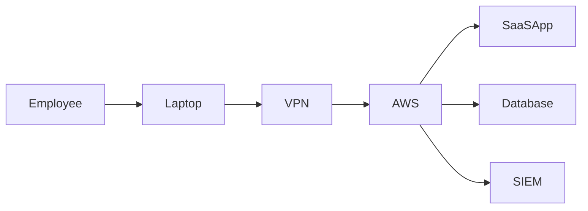

# ISO 27001:2022 Statement of Applicability (SoA) Assessment

## Project Overview

This project simulates an ISO/IEC 27001:2022 Statement of Applicability (SoA) assessment conducted for a cloud-native SaaS organization.

The objective was to determine which Annex A controls are applicable to the organization's Information Security Management System (ISMS), document justification for inclusion or exclusion, and evaluate the overall maturity of the security control environment.

This project demonstrates practical understanding of:

- ISO/IEC 27001:2022
- Annex A Controls
- Information Security Management Systems (ISMS)
- Risk-Based Thinking
- Control Applicability Decisions
- Governance & Compliance
- Audit Readiness

---

# Skills Demonstrated

- ISO/IEC 27001:2022
- Statement of Applicability (SoA)
- ISMS Implementation
- Information Security Governance
- Risk Assessment
- Security Control Evaluation
- Compliance Management
- Internal Audit Preparation
- Security Documentation

---

# Business Scenario

## Organization Profile

**Organization:** CloudTrack Technologies Pvt. Ltd.

CloudTrack Technologies is a Software-as-a-Service (SaaS) provider offering cloud-based project management and collaboration solutions to enterprise customers across Europe and Asia.

### Company Characteristics

- 250 Employees
- AWS Cloud Infrastructure
- Remote-First Workforce
- Multi-Tenant SaaS Platform
- Processes Customer PII
- Annual Security Audits
- ISO 27001 Certification Initiative

The organization initiated an ISMS implementation project and required a Statement of Applicability to support certification readiness activities.

---

# Project Objectives

The assessment focused on:

- Defining ISMS scope
- Reviewing Annex A controls
- Determining control applicability
- Identifying justified exclusions
- Evaluating implementation maturity
- Supporting audit readiness
- Aligning controls with business risks

---

# ISMS Scope

## Included Assets

The ISMS covers:

- SaaS Application Platform
- AWS Cloud Infrastructure
- Employee Endpoints
- Corporate IT Systems
- Customer Data Processing Activities
- Software Development Lifecycle
- Third-Party Supplier Management

---

## Excluded Assets

The following assets fall outside the ISMS scope:

- Customer-Owned Systems
- Personal Devices Not Authorized for Work Use
- Third-Party Managed Infrastructure Beyond Contractual Boundaries

---

# Risk Assessment Summary

The organization identified the following primary risks.

| Risk ID | Description | Impact |
|----------|------------|----------|
| R-001 | Unauthorized access to customer data | High |
| R-002 | Cloud infrastructure compromise | High |
| R-003 | Software vulnerabilities | High |
| R-004 | Data leakage | High |
| R-005 | Supplier compromise | Medium |
| R-006 | Business disruption | Medium |
| R-007 | Malware infection | Medium |
| R-008 | Insider threats | Medium |

The Statement of Applicability was developed to address these risks through appropriate security controls.

---

# Control Applicability Assessment

## Theme 5 — Organizational Controls

### Finding 01 — Information Security Policies (Control 5.1)

#### Decision

Applicable

#### Justification

The organization requires formal information security policies to establish governance expectations, define responsibilities, and support ISMS operations.

#### Implementation Status

Implemented

---

### Finding 02 — Threat Intelligence (Control 5.7)

#### Decision

Applicable

#### Justification

The organization operates a public-facing SaaS platform and must proactively identify emerging threats affecting cloud infrastructure and customer environments.

#### Implementation Status

Partially Implemented

#### Improvement Opportunity

Integrate threat intelligence feeds into the risk management process.

---

### Finding 03 — Supplier Security (Control 5.19)

#### Decision

Applicable

#### Justification

Critical business services depend on AWS, Microsoft 365, and multiple SaaS vendors.

Compromise of suppliers could impact confidentiality, integrity, or availability.

#### Implementation Status

Implemented

---

### Finding 04 — ICT Supply Chain Security (Control 5.21)

#### Decision

Applicable

#### Justification

The organization relies on external service providers and cloud vendors.

Supply chain attacks represent a significant risk to cloud-native organizations.

#### Implementation Status

Partially Implemented

---

### Finding 05 — Privacy & Protection of PII (Control 5.34)

#### Decision

Applicable

#### Justification

The organization processes customer personal information and must support GDPR obligations.

#### Implementation Status

Implemented

---

## Theme 6 — People Controls

### Finding 06 — Security Awareness Training (Control 6.3)

#### Decision

Applicable

#### Justification

Employees represent a major attack surface.

Regular awareness training reduces phishing and social engineering risks.

#### Implementation Status

Implemented

---

### Finding 07 — Remote Working (Control 6.7)

#### Decision

Applicable

#### Justification

CloudTrack operates as a remote-first organization.

Secure remote work controls are necessary to protect company assets.

#### Implementation Status

Implemented

---

## Theme 7 — Physical Controls

### Finding 08 — Physical Security Monitoring (Control 7.4)

#### Decision

Applicable

#### Justification

Corporate office facilities contain employee devices and sensitive information.

#### Implementation Status

Implemented

---

### Finding 09 — Supporting Utilities (Control 7.11)

#### Decision

Excluded

#### Justification

CloudTrack does not own or operate data centers.

Physical utilities such as power, cooling, and environmental systems are managed by AWS under the Shared Responsibility Model.

#### Alternative Control

Annual AWS assurance review.

---

### Finding 10 — Cabling Security (Control 7.12)

#### Decision

Excluded

#### Justification

All production infrastructure is hosted within AWS.

Physical networking infrastructure is managed by AWS.

#### Alternative Control

Vendor assurance and annual cloud provider risk assessments.

---

## Theme 8 — Technological Controls

### Finding 11 — Vulnerability Management (Control 8.8)

#### Decision

Applicable

#### Justification

Public-facing applications and cloud workloads require continuous vulnerability management.

#### Implementation Status

Implemented

---

### Finding 12 — Logging (Control 8.15)

#### Decision

Applicable

#### Justification

Security monitoring and incident investigations depend on centralized logging.

#### Implementation Status

Implemented

---

### Finding 13 — Network Security (Control 8.20)

#### Decision

Applicable

#### Justification

Cloud workloads require secure network segmentation and traffic control.

#### Implementation Status

Implemented

---

### Finding 14 — Secure Development Lifecycle (Control 8.25)

#### Decision

Applicable

#### Justification

The organization develops and maintains its own SaaS platform.

Security must be integrated into development activities.

#### Implementation Status

Implemented

---

### Finding 15 — Outsourced Development (Control 8.30)

#### Decision

Excluded

#### Justification

Software development is performed entirely by internal engineering teams.

No outsourced development activities exist.

#### Alternative Control

Internal SDLC governance process.

---

# Control Applicability Summary

| Theme | Applicable | Excluded |
|---------|---------|---------|
| Organizational Controls | 37 | 0 |
| People Controls | 8 | 0 |
| Physical Controls | 12 | 2 |
| Technological Controls | 33 | 1 |
| **Total** | **90** | **3** |

---

# Key Exclusions

The following controls were excluded after risk assessment.

| Control | Reason |
|----------|----------|
| 7.11 Supporting Utilities | Managed by AWS |
| 7.12 Cabling Security | Managed by AWS |
| 8.30 Outsourced Development | No outsourced development |

All exclusions were supported by documented justification and alternative controls.

---

# ISMS Maturity Assessment

| Area | Maturity |
|---------|---------|
| Governance | Mature |
| Risk Management | Mature |
| Asset Management | Mature |
| IAM | Mature |
| Secure Development | Mature |
| Supplier Security | Developing |
| Business Continuity | Developing |
| Monitoring & Logging | Mature |

---

# Auditor Notes

### Strengths

- Strong governance framework
- Mature IAM controls
- Effective cloud security controls
- Secure software development practices
- Comprehensive logging and monitoring

### Areas for Improvement

- Threat intelligence integration
- Supplier monitoring automation
- Business continuity testing frequency
- Data loss prevention maturity

---

# Final Assessment

## Statement of Applicability Result

Successfully Completed

---

## Control Coverage

- Applicable Controls: 90
- Excluded Controls: 3
- Justified Exclusions: 100%

---

## Certification Readiness

The organization demonstrates a mature security posture and appropriate control coverage for the defined ISMS scope.

Based on the assessment, the organization is well-positioned to proceed with:

- Internal Audit Activities
- Management Review
- Stage 1 Certification Audit
- Stage 2 Certification Audit

---

# Lessons Learned

- Control applicability should be driven by risk, not compliance checklists.
- Cloud-native organizations can legitimately exclude certain physical controls.
- Supplier security remains a critical governance challenge.
- Security governance is as important as technical controls.
- A strong SoA provides clear auditor justification for every control decision.

---

# Mermaid Diagram

---

# Author

**Swayam Nandi**

Governance, Risk & Compliance (GRC) Portfolio

ISO/IEC 27001:2022 | ISMS | Statement of Applicability | Audit Readiness

