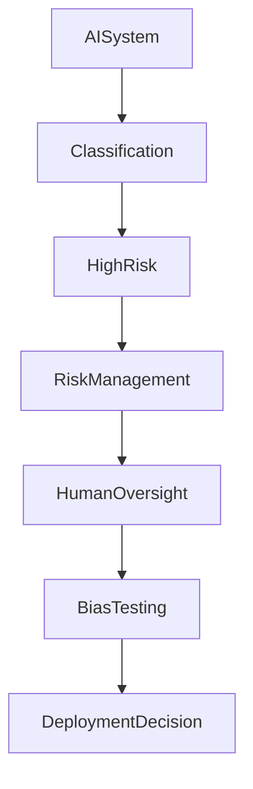

# EU AI Act High-Risk AI Assessment

## Project Overview

This project simulates an EU AI Act compliance assessment conducted for an AI-powered recruitment platform used by enterprise organizations across the European Union.

The objective was to determine whether the AI system qualifies as a High-Risk AI System under the EU AI Act, assess compliance obligations, evaluate impacts on fundamental rights, review human oversight mechanisms, and provide a deployment recommendation.

This project demonstrates practical understanding of:

- EU AI Act
- AI Governance
- Responsible AI
- Algorithmic Risk Management
- Fundamental Rights Impact Assessments (FRIA)
- Human Oversight Controls
- AI Compliance Frameworks

---

# Skills Demonstrated

- EU AI Act Compliance
- AI Governance
- AI Risk Assessment
- Human Oversight Evaluation
- Fundamental Rights Impact Assessment
- Bias & Fairness Analysis
- Compliance Documentation
- Responsible AI Practices
- Governance, Risk & Compliance (GRC)

---

# Business Scenario

## Organization Profile

**Organization:** TalentMatch AI Solutions GmbH

TalentMatch develops AI-powered hiring tools for large enterprises.

The company's flagship product uses machine learning models to:

- Analyze resumes
- Match candidates to job descriptions
- Score applicants
- Rank candidate suitability
- Assist recruiters during screening

The platform is used by organizations throughout the European Union.

---

## Business Challenge

Recruiters often receive thousands of applications for a single role.

TalentMatch AI was developed to:

- Reduce manual screening effort
- Improve recruiter productivity
- Standardize candidate evaluation
- Accelerate hiring decisions

Because hiring decisions directly impact employment opportunities, the system required an EU AI Act assessment before deployment.

---

# Project Objectives

The assessment focused on:

- Determining AI risk classification
- Assessing compliance with High-Risk AI requirements
- Evaluating fundamental rights impacts
- Reviewing bias and discrimination risks
- Assessing human oversight effectiveness
- Providing deployment recommendations

---

# AI System Overview

## Intended Purpose

TalentMatch AI evaluates job applicants and provides candidate rankings to recruiters.

The system assists decision-making but does not make final hiring decisions.

Human recruiters retain full authority over:

- Candidate selection
- Interview invitations
- Hiring outcomes

---

## Technical Architecture

| Component | Description |
|------------|------------|
| Model Type | NLP + Machine Learning Ranking Engine |
| Training Data | Historical hiring decisions and resumes |
| Input Data | Candidate resumes and job descriptions |
| Output | Candidate suitability scores |
| Deployment | Cloud-based SaaS Platform |
| Update Frequency | Quarterly Retraining |

---

# Risk Classification Assessment

## Classification Determination

After reviewing Annex III of the EU AI Act, the system was classified as:

## HIGH-RISK AI SYSTEM

### Reasoning

The system is used within:

> Employment, worker management, and access to self-employment.

Specifically:

- Candidate screening
- Applicant ranking
- Hiring recommendations

These use cases are explicitly identified as High-Risk under Annex III.

---

# Assessment Methodology

The assessment followed the requirements of:

- Article 9 — Risk Management
- Article 10 — Data Governance
- Article 11 — Technical Documentation
- Article 12 — Record Keeping
- Article 13 — Transparency
- Article 14 — Human Oversight
- Article 15 — Accuracy, Robustness, and Cybersecurity

---

# Risk Management Review

## Finding 01 — Risk Identification Process

### Observation

The organization maintains a documented AI risk register covering:

- Bias risks
- Privacy risks
- Security risks
- Operational risks

### Assessment

Compliant

### Maturity

High

---

## Finding 02 — Residual Risk Evaluation

### Observation

Risk assessments are performed during model deployment but not continuously.

### Risk

Emerging risks may remain undetected.

### Recommendation

Implement quarterly AI risk reviews.

### Maturity

Medium

---

# Data Governance Assessment

## Finding 03 — Training Data Quality

### Observation

Training datasets are curated and validated before use.

### Strengths

- Dataset validation process
- Quality checks
- Documentation standards

### Assessment

Compliant

---

## Finding 04 — Historical Hiring Bias

### Observation

Historical recruitment decisions show evidence of:

- Gender imbalance
- University preference bias
- Geographic bias

### Risk

Model may learn and replicate historical discrimination patterns.

### Recommendation

Implement enhanced fairness testing and bias monitoring.

### Risk Rating

High

---

# Transparency Assessment

## Finding 05 — User Transparency

### Observation

Recruiters receive candidate scores but limited explanation regarding how scores are generated.

### Risk

Users may over-rely on AI outputs without understanding limitations.

### Recommendation

Implement explainability dashboards and decision rationale indicators.

### Risk Rating

Medium

---

# Human Oversight Evaluation

## Existing Oversight Controls

Recruiters:

- Review all AI recommendations
- Can override rankings
- Can reject recommendations
- Make all final hiring decisions

---

## Finding 06 — Human Override Capability

### Observation

Recruiters can override all recommendations.

### Assessment

Compliant

### Maturity

High

---

## Finding 07 — Human Understanding of AI Limitations

### Observation

Recruiter training exists but is conducted only annually.

### Risk

Users may not fully understand model limitations.

### Recommendation

Provide role-specific AI governance training twice annually.

### Risk Rating

Medium

---

# Fundamental Rights Impact Assessment

The following rights were evaluated.

| Fundamental Right | Impact Level |
|-------------------|-------------|
| Human Dignity | Medium |
| Data Protection | High |
| Right to Work | High |
| Non-Discrimination | High |
| Effective Remedy | Medium |

---

## Finding 08 — Right to Work

### Observation

The AI system influences candidate progression during hiring.

### Risk

Incorrect rankings could reduce employment opportunities.

### Mitigation

Human review remains mandatory.

---

## Finding 09 — Non-Discrimination

### Observation

Protected characteristics may be indirectly inferred through:

- Names
- Educational history
- Employment history

### Risk

Potential discriminatory outcomes.

### Mitigation

Fairness testing and periodic bias audits.

---

# Bias & Fairness Assessment

## Protected Characteristics Reviewed

- Gender
- Race/Ethnicity
- Age
- Disability
- Religion
- Sexual Orientation
- Socioeconomic Status

---

## Fairness Testing Results

| Metric | Result |
|----------|----------|
| Gender Bias | Acceptable |
| Age Bias | Moderate |
| Ethnicity Proxy Bias | Low |
| False Positive Gap | Low |
| False Negative Gap | Moderate |

---

## Assessment Conclusion

The model demonstrates acceptable fairness performance but requires continuous monitoring.

Overall Bias Risk:

**Medium**

---

# Cybersecurity Assessment

## Finding 10 — Model Security

### Observation

The organization implemented:

- MFA
- Role-Based Access Control
- Audit Logging
- Encryption at Rest
- Encryption in Transit

### Assessment

Compliant

---

## Finding 11 — Adversarial Testing

### Observation

Limited testing has been performed against model manipulation attacks.

### Risk

Model outputs could potentially be influenced by malicious inputs.

### Recommendation

Introduce adversarial robustness testing.

### Risk Rating

Medium

---

# Risk Summary

| Risk | Rating |
|---------|---------|
| Historical Hiring Bias | High |
| Fundamental Rights Impact | High |
| Transparency Limitations | Medium |
| Human Oversight Gaps | Medium |
| Model Manipulation Risk | Medium |

---

# Deployment Recommendation

## Decision

### APPROVE WITH CONDITIONS

The system may proceed to deployment provided the following actions are completed:

1. Enhanced fairness testing
2. Explainability dashboard implementation
3. Adversarial testing program
4. Expanded recruiter training
5. Quarterly AI governance reviews

---

# Final Assessment

## Compliance Status

Partially Compliant

---

## AI Risk Classification

HIGH-RISK AI SYSTEM

---

## Overall Risk Rating

Medium

---

## Conclusion

TalentMatch AI qualifies as a High-Risk AI System under the EU AI Act due to its use in employment-related decision support.

The organization demonstrates a mature AI governance program and strong human oversight mechanisms. However, additional controls are required to strengthen fairness, transparency, and model robustness before full production deployment.

Following remediation of identified findings, the system would be suitable for operational deployment within the European Union.

---

# Lessons Learned

- AI systems can impact fundamental rights even when humans remain involved.
- Human oversight must be meaningful, not symbolic.
- Historical data is often the largest source of AI bias.
- Transparency and explainability are critical for High-Risk AI Systems.
- Compliance requires continuous governance rather than one-time assessments.

---

#Mermaid Diagram

---

# Author

**Swayam Nandi**

Governance, Risk & Compliance (GRC) Portfolio

EU AI Act | Responsible AI | AI Governance | High-Risk AI Assessment

