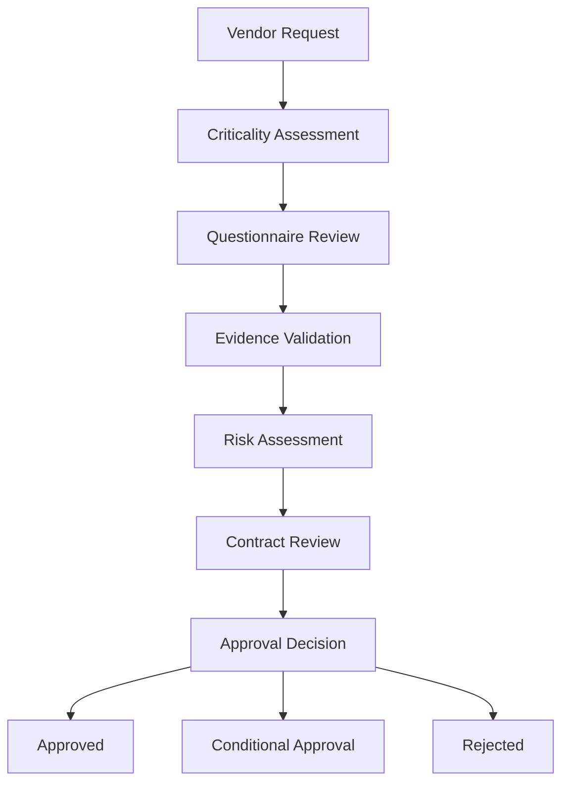

# Third-Party Risk Management (TPRM): Vendor Security Assessment

## Project Overview

This project simulates a Third-Party Risk Management (TPRM) assessment conducted for a cloud-based SaaS vendor before onboarding.

The objective was to evaluate the vendor's security posture, identify potential risks to the organization, review compliance evidence, assess contractual safeguards, and provide a recommendation regarding vendor approval.

The assessment follows common vendor due diligence practices used across enterprise security, compliance, and risk management programs.

---

# Skills Demonstrated

- Third-Party Risk Management (TPRM)
- Vendor Security Assessment
- Risk Assessment
- Security Governance
- ISO 27001 Review
- SOC 2 Review
- Compliance Evaluation
- Security Questionnaire Analysis
- Executive Risk Reporting

---

# Business Scenario

## Organization Profile

**Organization:** CloudTrack Technologies Pvt. Ltd.

CloudTrack intends to onboard a cloud-based customer support platform to improve customer service operations.

The proposed vendor will process:

- Customer Names
- Email Addresses
- Support Tickets
- Account Information

Because the vendor will have access to sensitive customer data, a formal Third-Party Risk Assessment was required before contract approval.

---

# Assessment Objectives

The assessment focused on:

- Security Governance
- Compliance Certifications
- Data Protection Controls
- Access Management
- Incident Response Capabilities
- Business Continuity Readiness
- Vendor Risk Rating
- Contractual Risk

---

# Assessment Methodology

The assessment followed a standard vendor risk review process.

## Phase 1 — Vendor Classification

Determine:

- Criticality
- Data Sensitivity
- Business Impact

---

## Phase 2 — Security Questionnaire Review

Review vendor responses regarding:

- Security Controls
- Governance Practices
- Compliance Programs

---

## Phase 3 — Evidence Validation

Validate:

- ISO 27001 Certification
- SOC 2 Reports
- Security Policies
- Penetration Test Reports

---

## Phase 4 — Risk Analysis

Evaluate:

- Likelihood
- Impact
- Residual Risk

---

## Vendor Profile

| Category | Details |
|-----------|----------|
| Vendor Name | HelpDeskPro Inc. |
| Service Type | Customer Support SaaS |
| Hosting Provider | AWS |
| Data Classification | Confidential |
| Business Criticality | High |
| Geographic Presence | Global |
| Customer Data Access | Yes |

---

# Vendor Criticality Assessment

## Finding 01 — Vendor Criticality

### Observation

The vendor supports customer-facing operations and stores customer information.

### Business Impact

Service disruption would affect customer support operations.

### Criticality Rating

**High**

---

# Compliance Assessment

## Finding 02 — ISO 27001 Certification

### Observation

Vendor maintains an active ISO/IEC 27001 certification.

### Evidence Reviewed

- ISO 27001 Certificate
- Certification Scope Statement

### Assessment

Compliant

### Risk Rating

Low

---

## Finding 03 — SOC 2 Type II Report

### Observation

Vendor provided a recent SOC 2 Type II report.

### Evidence Reviewed

- Independent Auditor Report
- Management Assertion

### Assessment

Compliant

### Risk Rating

Low

---

# Security Governance Review

## Finding 04 — Information Security Program

### Observation

Vendor maintains documented:

- Security Policies
- Risk Management Procedures
- Incident Response Plans
- Access Control Standards

### Assessment

Mature

### Risk Rating

Low

---

# Identity & Access Management Review

## Finding 05 — Multi-Factor Authentication

### Observation

Vendor enforces MFA for:

- Administrative Accounts
- Remote Access
- Cloud Infrastructure

### Assessment

Compliant

### Risk Rating

Low

---

## Finding 06 — Access Reviews

### Observation

Quarterly access reviews are conducted.

### Assessment

Compliant

### Risk Rating

Low

---

# Data Protection Assessment

## Finding 07 — Encryption Controls

### Observation

The vendor uses:

- AES-256 Encryption at Rest
- TLS 1.3 Encryption in Transit

### Assessment

Compliant

### Risk Rating

Low

---

## Finding 08 — Data Retention Controls

### Observation

Formal retention and disposal procedures exist.

### Assessment

Compliant

### Risk Rating

Low

---

# Incident Response Assessment

## Finding 09 — Security Incident Management

### Observation

The vendor maintains:

- Incident Response Procedures
- Escalation Matrix
- Breach Notification Process

### Assessment

Compliant

### Risk Rating

Low

---

## Finding 10 — Notification Timeline

### Observation

Vendor contract specifies breach notification within 72 hours.

### Assessment

Acceptable

### Risk Rating

Low

---

# Business Continuity Assessment

## Finding 11 — Disaster Recovery Program

### Observation

The vendor performs annual disaster recovery testing.

### Evidence Reviewed

- DR Test Summary
- Recovery Procedures

### Assessment

Compliant

### Risk Rating

Low

---

## Finding 12 — Recovery Objectives

| Metric | Value |
|----------|----------|
| Recovery Time Objective (RTO) | 4 Hours |
| Recovery Point Objective (RPO) | 1 Hour |

### Assessment

Acceptable

---

# Security Questionnaire Summary

## Areas Reviewed

- Governance
- Risk Management
- Asset Management
- Access Control
- Vulnerability Management
- Logging & Monitoring
- Incident Response
- Business Continuity
- Data Protection

---

## Results

| Category | Status |
|------------|------------|
| Governance | Pass |
| IAM | Pass |
| Data Protection | Pass |
| Incident Response | Pass |
| Business Continuity | Pass |
| Compliance | Pass |

---

# Risk Register

| Risk ID | Description | Rating |
|-----------|------------|---------|
| VR-001 | Cloud Service Dependency | Medium |
| VR-002 | Vendor Operational Disruption | Medium |
| VR-003 | Customer Data Exposure | Medium |
| VR-004 | Regulatory Compliance Changes | Low |

---

# Overall Risk Assessment

## Inherent Risk

**High**

Reason:

The vendor processes customer information and supports business-critical services.

---

## Residual Risk

**Medium**

Reason:

Strong security controls significantly reduce exposure.

---

# Contract Review

## Required Security Clauses

- Data Processing Agreement (DPA)
- Breach Notification Requirement
- Right to Audit
- Confidentiality Obligations
- Subprocessor Disclosure
- Data Deletion Requirements

---

## Assessment

All required clauses were included.

### Status

Approved

---

# Risk Treatment Recommendation

## Selected Approach

### Accept with Monitoring

The vendor demonstrates a mature security posture supported by:

- ISO 27001 Certification
- SOC 2 Type II Attestation
- Formal Security Governance
- Strong Access Controls
- Documented Incident Response

Residual risks remain acceptable within organizational risk tolerance.

---

# Continuous Monitoring Plan

## Annual Activities

- Vendor Reassessment
- Security Questionnaire Review
- Compliance Evidence Review

---

## Quarterly Activities

- Vendor Performance Review
- Incident Review
- Security Updates

---

## Trigger-Based Reviews

Additional reviews will occur if:

- Security Incident Occurs
- Compliance Status Changes
- Significant Service Changes Occur
- New Regulatory Requirements Emerge

---

# Final Decision

## Vendor Status

### APPROVED

---

## Residual Risk Rating

**Medium**

---

## Monitoring Requirement

**Annual Security Review Required**

---

# Lessons Learned

- Third-party vendors frequently introduce significant business risk.
- Certifications alone should not determine vendor approval.
- Security questionnaires must be validated through evidence.
- Contractual protections are critical components of vendor risk management.
- Continuous monitoring is as important as initial due diligence.

---

# Mermaid Diagram

---

# Author

**Swayam Nandi**

Governance, Risk & Compliance (GRC) Portfolio

Third-Party Risk Management | Vendor Security Assessment | Security Governance
