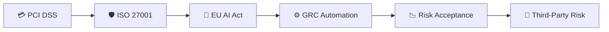

# Governance, Risk & Compliance (GRC) Portfolio

## 📂 Repository Structure

```text
📦 GRC-Portfolio
│
├── 📁 01-pci-dss-scope-determination
│   └── PCI DSS v4.0 Scope Determination & Network Segmentation Assessment
│
├── 📁 02-iso27001-statement-of-applicability
│   └── ISO/IEC 27001:2022 Statement of Applicability (SoA)
│
├── 📁 03-eu-ai-act-assessment
│   └── EU AI Act High-Risk AI System Assessment
│
├── 📁 04-grc-control-automation
│   └── Automated User Access Review (UAR) Control Design
│
├── 📁 05-risk-acceptance-assessment
│   └── Legacy VPN Risk Acceptance Assessment
│
├── 📁 06-third-party-risk-assessment
│   └── Vendor Security Due Diligence & TPRM Assessment
│
└── 📄 README.md
    └── Portfolio Overview & Project Roadmap
```

---

## 🗺️ Portfolio Roadmap



---

## 🎯 Project Coverage

| Project                        | Domain                | Framework         |
| ------------------------------ | --------------------- | ----------------- |
| 💳 PCI DSS Scope Determination | Compliance            | PCI DSS v4.0      |
| 🛡️ Statement of Applicability | ISMS                  | ISO 27001         |
| 🤖 High-Risk AI Assessment     | AI Governance         | EU AI Act         |
| ⚙️ Control Automation          | Continuous Compliance | SOC 2 / ISO 27001 |
| 📉 Risk Acceptance             | Risk Management       | ISO 27001         |
| 🏢 Vendor Security Assessment  | Third-Party Risk      | TPRM              |

## Overview

This repository contains a collection of practical Governance, Risk & Compliance (GRC) projects designed to demonstrate real-world security governance, compliance, risk management, audit readiness, and security assessment skills.

The projects simulate engagements commonly performed by GRC analysts, ISMS consultants, compliance specialists, internal auditors, and cybersecurity consultants working with frameworks such as:

- ISO/IEC 27001:2022
- PCI DSS v4.0
- SOC 2
- EU AI Act
- NIST Cybersecurity Framework
- Risk Management Frameworks
- Continuous Controls Monitoring (CCM)

The objective of this portfolio is to demonstrate not only knowledge of compliance frameworks, but also the ability to apply risk-based thinking, perform security assessments, document findings, and communicate recommendations in a manner suitable for auditors, regulators, and business stakeholders.

---

# Skills Demonstrated

## Governance

- Information Security Governance
- Security Policy Evaluation
- Statement of Applicability (SoA)
- Security Control Assessment
- Security Program Development

## Risk Management

- Risk Identification
- Risk Assessment
- Risk Treatment Planning
- Risk Acceptance
- Residual Risk Evaluation

## Compliance

- ISO 27001
- PCI DSS
- SOC 2
- EU AI Act
- Internal Audit Preparation

## Security Operations & Architecture

- Identity & Access Management
- Network Segmentation
- Security Monitoring
- Secure Development Lifecycle
- Compliance Automation

## Documentation & Audit Readiness

- Audit Evidence Preparation
- Compliance Reporting
- Executive Risk Reporting
- Gap Assessments
- Auditor-Facing Documentation

---
# Portfolio's Project Roadmap

## Project 01 — PCI DSS Scope Determination & Network Segmentation Assessment

### Objective

Determine the true Cardholder Data Environment (CDE), evaluate segmentation effectiveness, identify hidden PCI scope, and prepare for a future PCI DSS assessment.

### Key Activities

- Scope Determination
- Data Flow Analysis
- Trust Relationship Assessment
- Network Segmentation Review
- Security Impact Analysis
- Audit Readiness Assessment

### Skills Demonstrated

- PCI DSS v4.0
- Network Security
- Scope Reduction
- Risk Assessment
- Security Governance

**Project Folder:** `01-pci-dss-scope-determination`

---

## Project 02 — ISO 27001 Statement of Applicability Assessment

### Objective

Develop and assess an ISO/IEC 27001:2022 Statement of Applicability for a cloud-native SaaS organization preparing for certification.

### Key Activities

- ISMS Scope Definition
- Control Applicability Assessment
- Risk-Based Control Selection
- Justified Control Exclusions
- Certification Readiness Review

### Skills Demonstrated

- ISO/IEC 27001
- Information Security Governance
- Risk Management
- Internal Audit Preparation
- Compliance Documentation

**Project Folder:** `02-iso27001-statement-of-applicability`

---

## Project 03 — EU AI Act High-Risk AI Assessment

### Objective

Assess an AI-powered recruitment platform against EU AI Act requirements and determine deployment readiness.

### Key Activities

- High-Risk Classification Analysis
- Fundamental Rights Impact Assessment
- Human Oversight Review
- Bias & Fairness Assessment
- AI Governance Evaluation

### Skills Demonstrated

- AI Governance
- Responsible AI
- Risk Assessment
- Regulatory Compliance
- Compliance Documentation

**Project Folder:** `03-eu-ai-act-assessment`

---

## Project 04 — GRC Control Automation Design

### Objective

Design an automated User Access Review (UAR) control to replace a manual compliance process and improve audit readiness.

### Key Activities

- Continuous Controls Monitoring
- Access Governance
- Compliance Automation
- Evidence Generation
- Control Design

### Skills Demonstrated

- SOC 2
- ISO 27001
- IAM
- Compliance Automation
- Security Operations

**Project Folder:** `04-grc-control-automation`

---

## Project 05 — Risk Acceptance Assessment

### Objective

Evaluate a legacy VPN authentication risk, compare remediation options, and provide an executive-level risk acceptance recommendation.

### Key Activities

- Risk Analysis
- Cost-Benefit Assessment
- Residual Risk Evaluation
- Executive Reporting
- Risk Treatment Planning

### Skills Demonstrated

- Risk Management
- Security Governance
- Business Risk Analysis
- ISO 27001 Risk Treatment
- Executive Communication

**Project Folder:** `05-risk-acceptance-assessment`

---

# Portfolio Learning Outcomes

Through these projects, I developed practical experience in:

- Assessing security controls against industry frameworks
- Performing risk-based decision making
- Evaluating compliance requirements
- Documenting security findings
- Preparing auditor-ready evidence
- Designing governance and compliance processes
- Communicating technical risks to business stakeholders

---

# Target Roles

This portfolio aligns closely with responsibilities commonly found in:

- GRC Analyst
- Information Security Analyst
- ISMS Analyst
- Compliance Analyst
- Cyber Risk Consultant
- Security Governance Analyst
- Internal Audit Associate
- Risk & Compliance Associate
- Security Compliance Specialist

---

# Frameworks Covered

| Framework | Coverage |
|------------|------------|
| ISO/IEC 27001:2022 | ✔ |
| PCI DSS v4.0 | ✔ |
| SOC 2 | ✔ |
| EU AI Act | ✔ |
| NIST CSF | ✔ |
| Risk Management Practices | ✔ |

---

# About Me

I am a cybersecurity and GRC professional with interests in:

- Security Governance
- Compliance
- Risk Management
- Audit Readiness
- Information Security
- Cloud Security Governance
- AI Governance

This portfolio represents practical case-study projects created to strengthen real-world GRC skills and demonstrate applied security governance capabilities.

---

# Why This Portfolio Exists

Many compliance projects focus only on controls and checklists.

The objective of this portfolio is different.

Each project is designed to answer questions such as:

- What is the actual risk?
- Which assumptions are unsafe?
- How would an auditor challenge this?
- What evidence supports the conclusion?
- What business decision should be made?

The goal is to demonstrate practical GRC thinking rather than compliance theatre.

---

A practical portfolio of Governance, Risk, and Compliance projects that demonstrate **judgment, not memorization**. These projects mirror how security decisions are actually made inside organizations.
```text
+------------------------------------------------------------------+
|                     GRC PROFESSIONAL MINDSET                     |
+------------------------------------------------------------------+
|                                                                  |
|  +------------+       +------------+       +------------+        |
|  | Activity   |       | Impact     |       | Judgment   |        |
|  | (Weak)     |  ≠    | (Strong)   |  =    | (Goal)     |        |
|  +------------+       +------------+       +------------+        |
|                                                                  |
|  Control mappings     Risk-driven           Defending decisions  |
|  Policy templates     decisions             under uncertainty    |
|  Framework lists      Business context      Trade-off analysis   |
|                                                                  |
+------------------------------------------------------------------+
```
## Why This Portfolio Exists

The GRC market has matured. Framework familiarity is assumed. Documentation alone is no longer impressive.

**What organizations actually need:**

- People who can interpret requirements
- Professionals who balance competing priorities
- Individuals who defend decisions when challenged

**What this portfolio demonstrates:**

- Understanding of *why* controls exist
- Judgment about *when* controls matter and when they don't
- Ability to justify security decisions when answers aren't obvious

---

| # | Project | Framework/Domain | Core Skill Demonstrated |
|---|---------|-----------------|------------------------|
| 01 | [PCI DSS Network Segmentation Review](./01-pci-dss-network-segmentation/README.md) | PCI DSS | Defending risk claims under audit scrutiny |
| 02 | [ISO 27001 Statement of Applicability](./02-iso27001-statement-of-applicability/README.md) | ISO 27001 | Risk-driven control exclusions |
| 03 | [EU AI Act High-Risk Assessment](./03-eu-ai-act-high-risk-assessment/README.md) | EU AI Act | Translating regulation to operational reality |
| 04 | [GRC Control Automation](./04-grc-control-automation/README.md) | GRC Engineering | Bridging governance and engineering |
| 05 | [Risk Acceptance Documentation](./05-risk-acceptance-documentation/README.md) | Enterprise Risk | Communicating risk to business leaders |
---

## The Difference Between Weak and Strong GRC Work
```text
┌──────────────────────────────────────────────────────────────────────────────┐
│                        WEAK GRC PROJECT                                      │
├──────────────────────────────────────────────────────────────────────────────┤
│                                                                              │
│  • Screenshots of compliance dashboards                                      │
│  • Control mappings without context                                          │
│  • Copied policy templates                                                   │
│  • Lists of frameworks "worked with"                                         │
│  • Diagrams without defensible arguments                                     │
│                                                                              │
│  Result: Looks like coursework. AI can produce this.                         │
│                                                                              │
└──────────────────────────────────────────────────────────────────────────────┘

┌──────────────────────────────────────────────────────────────────────────────┐
│                        STRONG GRC PROJECT                                    │
├──────────────────────────────────────────────────────────────────────────────┤
│                                                                              │
│  • Scenario with realistic constraints                                       │
│  • Documented assumptions and trade-offs                                     │
│  • Explicit decisions with justifications                                    │
│  • Anticipated challenges and responses                                      │
│  • Clear explanation of residual risk                                        │
│                                                                              │
│  Result: Demonstrates judgment. Shows how you think.                         │
│                                                                              │
└──────────────────────────────────────────────────────────────────────────────┘
```
---

## Real GRC Truth
```text
┌─────────────────────────────────────────────────────────────────────────────┐
│                                                                             │
│   "Real GRC work is messy. Requirements are vague. Business constraints     │
│    are real. Perfect compliance is almost never achievable. And most of     │
│    the job involves explaining uncomfortable truths to people who would     │
│    rather hear simple answers."                                             │
│                                                                             │
└─────────────────────────────────────────────────────────────────────────────┘
```
---

## Author

**Swayam Nandi**

Governance • Risk • Compliance • Security
